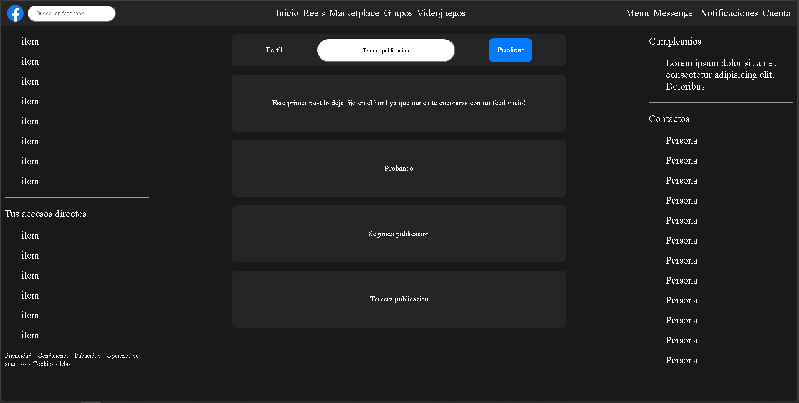

# Réplica de Facebook

Maqueta basica de FB donde se agrega lo explicado en cada clase.

## 🚀 Funcionalidades
- **Feed dinámico:** Podes escribir en el input y publicar posts reales en pantalla, si queres publicar sin tener nada escrito va a saltar alerta dando aviso.
- **Diseño responsive:** Funciona en distintas pantallas, tanto navegadores de escritorio como celulares.

## 🛠️ Tecnologías utilizadas
- [x] HTML5
- [x] CSS3 (Flexbox y Grid)
- [x] JavaScript

## 📸 Captura de pantalla

## ✒️ Autor
* **Axel** - [Perfil Github](https://github.com/Axelmarting)